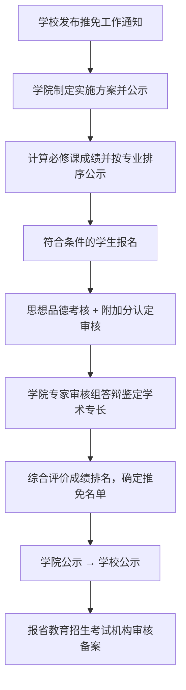

---
tags:
  - 绿皮书
  - 推免保送
---

# 🎓 推免保送须知

!!! info "📋 政策依据"
    本页面内容依据《[济南大学推荐优秀应届本科毕业生免试攻读研究生工作实施办法](appendix/推免相关/济南大学推荐优秀应届本科毕业生免试攻读研究生工作实施办法.md)》（济大校字〔2023〕134 号）整理，详细条款请查阅原文。

推免（推荐优秀应届本科毕业生免试攻读研究生）是指应届本科毕业生**不经过全国研究生入学统一考试初试**，直接进入复试的升学途径。

---

## 📋 推免基本条件

| 条件 | 要求 |
| ------ | ------ |
| **身份** | 纳入国家普通全日制本科招生计划录取的应届毕业生（不含专升本、第二学士学位） |
| **思想品德** | 理想信念坚定，社会责任感强，遵纪守法，思想品德考核合格 |
| **纪律** | 无违法违纪处分记录，无考试作弊和抄袭学术成果记录 |
| **成绩** | 前六学期（五年制前八学期）必修课学分加权平均成绩排名在**本年级同专业前 30%** 以内 |
| **英语** | CET-6 ≥ 426 分（艺术/体育类 CET-4 ≥ 450 分），或 IELTS ≥ 6.0，或 TOEFL(IBT) ≥ 80 |
| **身体** | 符合报考研究生的体检标准 |

### 成绩计算公式

$$
\text{必修课程学分加权平均成绩} = \frac{\sum(\text{课程成绩} \times \text{课程学分})}{\sum\text{课程学分}}
$$

!!! warning "注意"
    同一门课程多次考试的，按照**首次考试成绩**计算。

---

## 🏆 综合评价与排名

推免生最终排名依据**综合评价成绩**确定：

$$
\text{综合评价成绩} = \text{必修课程学分加权平均成绩} \times 90\% + \text{附加分} \times 10\%
$$

也就是说，**学业成绩占 90%，附加分占 10%**。学业成绩是核心，附加分是锦上添花。

---

## ➕ 附加分认定

附加分主要考察学生的**学术专长**，可加分的项目包括：

### 科研竞赛

| 获奖等级 | 一类赛事 | 二类赛事 |
| ---------- | ---------- | ---------- |
| 国家/国际特等奖 | 30 分 | 15 分 |
| 国家/国际一等奖（金奖） | 15 分 | 10 分 |
| 国家/国际二等奖（银奖） | 10 分 | 8 分 |
| 国家/国际三等奖（铜奖） | 5 分 | 4 分 |

!!! info "赛事类别"
    赛事分类依据学校学生科技创新赛事类别及获奖等级认定相关文件执行。

### 科研成果

| 成果类型 | 附加分 |
| ---------- | -------- |
| 授权发明专利（第一发明人，专利权人为济南大学） | 3 分/项 |
| 顶级论文（中科院一区/社科顶级期刊等） | 5 分/篇 |
| 高水平论文（SCI/EI/CSSCI/SSCI 等收录） | 2.5 分/篇 |
| 核心期刊论文 | 1 分/篇 |

!!! info "论文要求"
    - 独立作者或**第一作者**，济南大学为**第一署名单位**
    - 原则上须符合所在学科研究方向
    - 论文分类详见 [附加分值表](appendix/推免相关/附件%20济南大学推免生附加分值表.md)

### 荣誉称号

| 荣誉 | 附加分 |
|------|--------|
| 省级及以上三好学生、优秀学生干部、优秀团员/团干部 | 1 分/项（可累加） |

### 多人合作项目分值计算

多人完成的竞赛/项目，每人附加分按以下公式分配：

$$
\text{个人附加分} = \text{附加分标准} \times \frac{(N - M + 1)}{1 + 2 + 3 + \dots + N}
$$

其中 $N$ 为完成总人数，$M$ 为本人所在位次。

### 附加分规则总结

- 附加分**累计上限 100 分**，超过按 100 分计算
- 多项科研竞赛获奖时，**原则上只取最高一项**计入
- 与直系亲属或学历/职称/职务明显高于本人者合作的成果**仅作参考**，不计入附加分
- 不为仅符合单一或部分指标的学生单列计划或破格推荐

---

## 📅 推免工作流程

---

## ⚠️ 重要提醒

!!! warning "推免后不得考研"
    经审核备案的推免生**不得参加当年全国研究生入学考试**，否则取消推免资格。

!!! tip "同等条件优先"
    以下经历在同等条件下可**优先考虑**（但不单独加分）：
    - 参军入伍服兵役
    - 参加志愿服务
    - 国际组织实习

---

## ❓ 常见问题

**Q：成绩排名前 30% 是按什么算的？**
A：按**本年级同专业**（教育部批准设置的本科专业，不再细分专业方向）学生的必修课学分加权平均成绩排名。

**Q：附加分只有 10%，是不是不重要？**
A：附加分占 10%，但名额有限时，附加分往往是排名拉开差距的关键。建议在保证学业成绩的同时，积极参与科研竞赛。

**Q：竞赛获奖怎么知道是一类还是二类？**
A：赛事分类依据学校学生科技创新赛事类别认定文件，具体可咨询学院教务办或查看 [附加分值表](appendix/推免相关/附件%20济南大学推免生附加分值表.md)。

**Q：对推免结果有异议怎么办？**
A：可实名向学校推免工作领导小组办公室书面反映；认为有舞弊行为的可向学校纪检监察部门举报。
