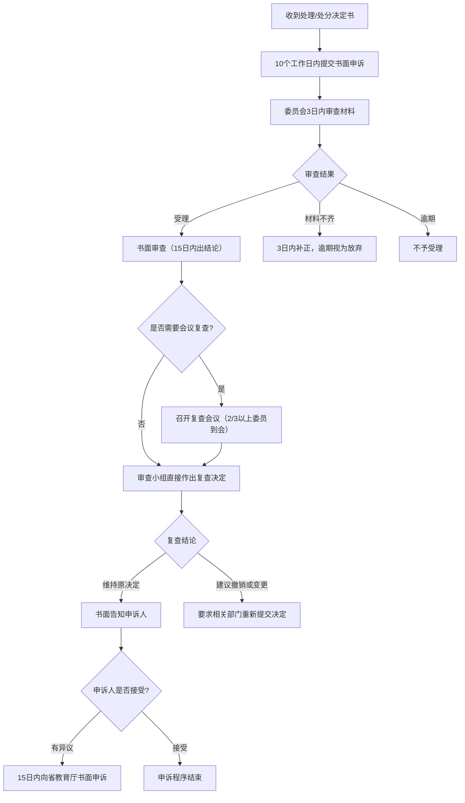

---
tags:
  - 绿皮书
  - 学生申诉
---

# 📢 学生申诉指南

!!! info "📋 政策依据"
    本页面内容依据《[济南大学学生申诉办法](济南大学学生申诉办法/济南大学学生申诉办法.md)》（济大校字〔2025〕42 号）整理，详细条款请查阅原文。

当学生对学校做出的涉及本人权益的**处理或处分决定**有异议时，有权向学校学生申诉处理委员会提出申诉，要求复查。

---

## 📋 申诉基本条件

| 条件 | 说明 |
| ------ | ------ |
| **适用对象** | 具有我校学籍的全日制本科生、研究生 |
| **申诉范围** | 对学校做出的涉及本人权益的处理或处分决定有异议 |
| **申诉时限** | 收到处理或处分决定书之日起 **10 个工作日内** |
| **受理机构** | 济南大学学生申诉处理委员会（办公室设在党委学生工作部） |

!!! warning "注意时限"
    申诉期限为**工作日**，节假日、公休日不含在内。逾期未提出申诉视为放弃。

---

## 📝 申诉材料准备

申诉时需提交以下材料：

1. **书面申诉申请书**（[模板](济南大学学生申诉办法/附件1%20济南大学学生申诉书.md)），载明：
    - 申诉人姓名、班级、学号、住所和联系方式
    - 申诉的要求和所依据的事项与理由
    - 相关文件和证据，证人姓名、住所和联系方式
    - 申请人签名和申诉日期
2. 学校处理或处分决定的**文件副本**（复印件）

---

## 🔄 申诉流程

---

## ⚖️ 复查会议规则

| 项目 | 要求 |
| ------ | ------ |
| **到会人数** | 三分之二以上委员到会方可召开 |
| **表决方式** | 无记名投票、举手表决或口头表达（不可通讯方式） |
| **通过条件** | 到会委员半数以上（不含半数）同意 |

### 会议一般程序

1. 主持人介绍到会委员情况，宣布会议开始
2. 询问有无需要回避的人员
3. 申诉人（代理人）陈述，或所在学院代表陈述
4. 做出处理决定的部门代表陈述
5. 委员发表意见
6. 委员会会议讨论
7. 委员会表决，形成书面意见

---

## ⚠️ 重要提醒

!!! tip "申诉期间原决定是否执行？"
    申诉期间，原处理或处分决定**继续执行**（开除学籍处分除外）。委员会认为必要的，可以建议学校暂缓执行。

!!! warning "放弃申诉的后果"
    处理、处分或复查决定书送达之日起，学生在申诉期内未提出申诉的，视为**放弃申诉**，学校不再受理。

!!! info "向上级申诉"
    对复查意见仍有异议的，可在收到复查意见书之日起 **15 个工作日内**向**山东省教育厅**提出书面申诉。

---

## 📎 相关文件

| 文件 | 说明 |
| ------ | ------ |
| [济南大学学生申诉办法](济南大学学生申诉办法/济南大学学生申诉办法.md) | 完整制度原文 |
| [学生申诉书模板](济南大学学生申诉办法/附件1%20济南大学学生申诉书.md) | 申诉时填写 |
| [撤回申诉申请书模板](济南大学学生申诉办法/附件2%20济南大学学生撤回申诉申请书.md) | 需要撤回时填写 |

---

## ❓ 常见问题

**Q：什么情况可以申诉？** 
A：对学校做出的涉及本人权益的处理或处分决定有异议，如违纪处分、取消学籍、退学处理等，均可申诉。

**Q：超过 10 个工作日还能申诉吗？** 
A：如果决定书未告知申诉期限，申诉期限自知道或应当知道之日起计算，但最长不超过 **6 个月**。

**Q：申诉可以撤回吗？** 
A：可以。在复查决定做出前，提交书面 [撤回申诉申请书](济南大学学生申诉办法/附件2%20济南大学学生撤回申诉申请书.md) 即可。撤回后程序终止，不再接受同一事项的申诉。

**Q：申诉需要请律师吗？** 
A：不需要。学生可以自己陈述，也可以指定代理人（如同学、辅导员等）代为陈述。
