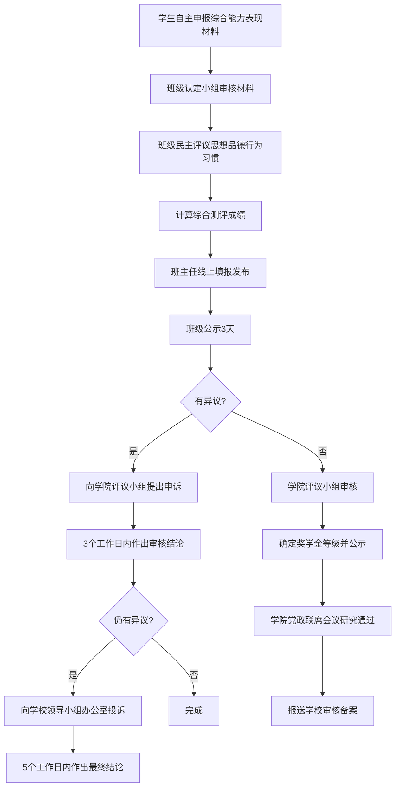

---
tags:
  - 绿皮书
  - 奖学金
---

# 🏆 荣誉评选 & 奖金须知

!!! info "📋 管理办法依据"
    本页面内容依据《[济南大学学生荣誉认定管理办法(试行)](appendix/荣誉评选%26奖金/济南大学学生荣誉认定管理办法(试行).md)》整理，详细条款请查阅原文。

以下是济南大学学生荣誉与奖学金的完整一览表，包含评选时间、名额比例和奖励金额等关键信息。

---

## 📊 济南大学学生荣誉一览表

| 类别 | 级别 | 名称 | 评选时间 | 评选数量(比例) | 奖励金额 |
|------|------|------|----------|----------------|----------|
| 奖学金 | Ⅰ | [济南大学"宋健奖学金"](appendix/荣誉评选%26奖金/奖学金/济南大学“宋健奖学金”评审表彰办法.md) | 每年4月 | 不超过10人 | **10000元/年/人** |
| 奖学金 | Ⅰ | [国家奖学金](appendix/荣誉评选%26奖金/奖学金/济南大学本科生国家和省政府奖学金管理实施办法.md) | 每年10月 | 60人左右 | **8000元/年/人** |
| 奖学金 | Ⅰ | [国家励志奖学金](appendix/荣誉评选%26奖金/奖学金/济南大学本科生励志奖学金管理实施办法.md) | 每年10月 | 1000人左右 | **5000元/年/人** |
| 奖学金 | Ⅱ | [山东省政府奖学金](appendix/荣誉评选%26奖金/奖学金/济南大学本科生国家和省政府奖学金管理实施办法.md) | 每年10月 | 20人左右 | **6000元/年/人** |
| 奖学金 | Ⅱ | [山东省政府励志奖学金](appendix/荣誉评选%26奖金/奖学金/济南大学本科生励志奖学金管理实施办法.md) | 每年10月 | 200人左右 | **5000元/年/人** |
| 奖学金 | Ⅲ | [济南大学本科生奖学金](appendix/荣誉评选%26奖金/济南大学本科生综合测评实施办法(试行).md) | 毕业生6月，非毕业生9-10月 | 一等7%、二等10%、三等15% | 一等1000元、二等700元、三等500元 |
| 奖学金 | Ⅳ | 社会各界设立的奖学金 | — | 由设立方与学校商定 | — |

---

## 🏅 个人荣誉称号

| 级别 | 名称 | 评选时间 | 数量(比例) | 详细办法 |
|------|------|----------|------------|----------|
| Ⅰ | 全国优秀学生干部 | — | 上级分配名额 | [查看](appendix/荣誉评选%26奖金/个人荣誉称号/全国优秀学生干部推荐办法.md) |
| Ⅰ | 全国三好学生 | — | 上级分配名额 | [查看](appendix/荣誉评选%26奖金/个人荣誉称号/全国三好学生推荐办法.md) |
| Ⅰ | 全国优秀共青团员 | — | 上级分配名额 | [查看](appendix/荣誉评选%26奖金/个人荣誉称号/全国优秀共青团员推荐办法.md) |
| Ⅰ | 青少年科技创新奖 | — | 上级分配名额 | [查看](appendix/荣誉评选%26奖金/个人荣誉称号/%E2%80%9C中国青少年科技创新奖%E2%80%9D候选人推荐办法.md) |
| Ⅰ | 中国大学生年度人物 | — | 上级分配名额 | [查看](appendix/荣誉评选%26奖金/个人荣誉称号/中国大学生年度人物推荐办法.md) |
| Ⅱ | 山东高校十大优秀学生 | 每年3月 | 全省10人，学校推荐2人 | [查看](appendix/荣誉评选%26奖金/个人荣誉称号/山东高校十大优秀学生候选人推荐办法.md) |
| Ⅱ | 山东省优秀学生 | 每年3月 | 30名左右 | [查看](appendix/荣誉评选%26奖金/个人荣誉称号/山东省优秀学生推荐办法.md) |
| Ⅱ | 山东省优秀学生干部 | 每年3月 | 20名左右 | [查看](appendix/荣誉评选%26奖金/个人荣誉称号/山东省优秀学生干部推荐办法.md) |
| Ⅱ | 山东省优秀共青团员 | — | 上级分配名额 | [查看](appendix/荣誉评选%26奖金/个人荣誉称号/山东省优秀共青团员推荐办法.md) |
| Ⅱ | 山东省优秀毕业生 | 每年3月 | 应届毕业生总数的5% | [查看](appendix/荣誉评选%26奖金/个人荣誉称号/山东省优秀毕业生推荐办法.md) |
| Ⅱ | 山东省青年志愿服务先进个人 | 两年一次，9月 | 上级分配名额 | [查看](appendix/荣誉评选%26奖金/个人荣誉称号/山东省青年志愿服务先进个人推荐办法.md) |
| Ⅱ | 山东省"三下乡"社会实践优秀学生 | 每年9月 | 35名左右 | [查看](appendix/荣誉评选%26奖金/个人荣誉称号/山东省大中专学生志愿者暑期%E2%80%9C三下乡%E2%80%9D社会实践优秀学生推荐办法.md) |
| Ⅲ | 济南大学优秀学生 | 毕业生6月，非毕业生9-10月 | 班级人数的7% | [查看](appendix/荣誉评选%26奖金/个人荣誉称号/济南大学优秀学生评选办法.md) |
| Ⅲ | 济南大学优秀学生干部 | 毕业生6月，非毕业生9-10月 | 班级人数的7%，校院组织干部的20% | [查看](appendix/荣誉评选%26奖金/个人荣誉称号/济南大学优秀学生干部评选办法.md) |
| Ⅲ | 济南大学优秀毕业生 | 每年12月 | 应届毕业生总数的10% | [查看](appendix/荣誉评选%26奖金/个人荣誉称号/济南大学优秀毕业生评选办法.md) |
| Ⅲ | 济南大学十佳团员 | 每年4月 | 10人 | [查看](appendix/荣誉评选%26奖金/个人荣誉称号/济南大学十佳团员评选办法.md) |
| Ⅲ | 济南大学优秀团员 | 每年4月 | 全校团员人数的5% | [查看](appendix/荣誉评选%26奖金/个人荣誉称号/济南大学优秀团员评选办法.md) |
| Ⅲ | 济南大学优秀团干部 | 每年4月 | 全校团干部的15% | [查看](appendix/荣誉评选%26奖金/个人荣誉称号/济南大学优秀团干部评选办法.md) |
| Ⅲ | 济南大学优秀青年志愿者 | 每年4月 | 注册志愿者数的25% | [查看](appendix/荣誉评选%26奖金/个人荣誉称号/济南大学优秀青年志愿者评选办法.md) |
| Ⅲ | 济南大学十佳志愿者 | 每年4月 | 10人 | [查看](appendix/荣誉评选%26奖金/个人荣誉称号/济南大学十佳志愿者评选办法.md) |
| Ⅲ | 济南大学社会实践优秀学生 | 每年9月 | 校团委按队伍分配 | [查看](appendix/荣誉评选%26奖金/个人荣誉称号/济南大学社会实践优秀学生评选办法.md) |
| Ⅲ | 济南大学社会工作先进个人 | 每年9月 | 学院学生数的5% | [查看](appendix/荣誉评选%26奖金/个人荣誉称号/济南大学社会工作先进个人评选办法.md) |
| Ⅲ | 济南大学优秀心灵使者 | 每年4-5月 | 心灵使者人数的10%，心协干部的20% | [查看](appendix/荣誉评选%26奖金/个人荣誉称号/济南大学优秀心灵使者评选办法.md) |
| Ⅲ | 济南大学优秀教学信息员 | 每年6月 | 全校教学信息员的10% | — |

---

## 🏛️ 集体荣誉称号

| 级别 | 名称 | 评选时间 | 数量(比例) | 详细办法 |
|------|------|----------|------------|----------|
| Ⅰ | 全国先进班集体 | — | 上级分配名额 | [查看](appendix/荣誉评选%26奖金/集体荣誉称号/全国先进班集体推荐办法.md) |
| Ⅰ | 全国五四红旗团委(团支部) | — | 上级分配名额 | [查看](<appendix/荣誉评选%26奖金/集体荣誉称号/全国五四红旗团委（团支部）推荐办法.md>) |
| Ⅰ | 大学生"小平科技创新团队" | — | 上级分配名额 | [查看](appendix/荣誉评选%26奖金/集体荣誉称号/大学生%E2%80%9C小平科技创新团队%E2%80%9D推荐办法.md) |
| Ⅱ | 山东省先进班集体 | 每年3月 | 9个左右 | [查看](appendix/荣誉评选%26奖金/集体荣誉称号/山东省先进班集体推荐办法.md) |
| Ⅱ | 山东省五四红旗团委(团支部) | 每年4月 | 上级分配名额 | [查看](appendix/荣誉评选%26奖金/集体荣誉称号/山东省五四红旗团委（团支部）推荐办法.md) |
| Ⅱ | 山东省青年志愿服务先进集体 | 每年4月 | 上级分配名额 | [查看](appendix/荣誉评选%26奖金/集体荣誉称号/山东省青年志愿服务先进集体推荐办法.md) |
| Ⅱ | 山东省"三下乡"社会实践优秀团队 | 每年10月 | 按年分配名额 | [查看](appendix/荣誉评选%26奖金/集体荣誉称号/山东省大中专学生志愿者暑期%E2%80%9C三下乡%E2%80%9D社会实践优秀团队推荐办法.md) |
| Ⅲ | 济南大学先进班集体 | 每年10月 | 班级总数的10% | [查看](appendix/荣誉评选%26奖金/集体荣誉称号/济南大学先进班集体评选办法.md) |
| Ⅲ | 济南大学十佳团支部 | 每年4月 | 10个 | [查看](appendix/荣誉评选%26奖金/集体荣誉称号/济南大学十佳团支部评选办法.md) |
| Ⅲ | 济南大学优秀团支部 | 每年4月 | 团支部总数的15% | [查看](appendix/荣誉评选%26奖金/集体荣誉称号/济南大学优秀团支部评选办法.md) |
| Ⅲ | 济南大学十佳志愿者服务队 | 每年4月 | 10个 | [查看](appendix/荣誉评选%26奖金/集体荣誉称号/济南大学十佳志愿者服务队评选办法.md) |
| Ⅲ | 济南大学十佳社团 | 每年4月 | 10个 | [查看](appendix/荣誉评选%26奖金/集体荣誉称号/济南大学学生社团评优考核细则.md) |

---

!!! tip "💡 级别说明"
    - **Ⅰ 类**：国家级荣誉
    - **Ⅱ 类**：省级荣誉
    - **Ⅲ 类**：校级荣誉
    - **Ⅳ 类**：院级荣誉
    - **Ⅴ 类**：其他

---

## 📐 综合测评办法（校级奖学金评定依据）

校级奖学金（济南大学本科生奖学金）的评定以**综合测评成绩**为主要依据。综合测评每学年进行一次，非毕业班每年9-10月实施，毕业班每年6月实施。

!!! info "📎 完整原始文件"
    如需查看完整的综合测评办法原文，请访问 [济南大学本科生综合测评实施办法(试行)](appendix/荣誉评选%26奖金/济南大学本科生综合测评实施办法(试行).md)

### 成绩计算公式

$$
\text{综合测评成绩} = \frac{\text{综合素质评价成绩}}{20} \times 25\% + \text{学业水平评价成绩} \times 75\%
$$

### 综合素质评价（满分100分）

| 评价维度 | 分值 | 评价方式 |
|----------|------|----------|
| **思想品德行为习惯** | 30分 | 班级民主评议 |
| **综合能力表现** | 70分 | 自主申报 + 认定小组审核 |

#### 思想品德行为习惯（30分）

| 项目 | 分值 | 考察内容 |
|------|------|----------|
| 政治素养 | 10分 | 理想信念、爱国主义、价值观、意志品质等 |
| 品德修养 | 10分 | 社会公德、职业道德、家庭美德、个人品德等 |
| 纪律观念 | 5分 | 遵纪守法、课堂考勤、公寓管理、集体活动等 |
| 诚信评价 | 5分 | 学业、学术、品行等诚信方面 |

#### 综合能力表现（70分）

| 项目 | 分值 | 说明 |
|------|------|------|
| **基础分** | 20分 | 第二课堂成绩（5分）+ 公益劳动（5分）+ 体质健康（5分）+ 宿舍管理（5分） |
| **能力分** | 50分 | 评优树先、社会工作、社会实践、创新创业、文体活动等 |

### 学业水平评价

采用**平均学分绩点（GPA）**作为评价指标，以教务处提供的学生所修读课程成绩为准。

### 奖学金等级与比例

| 等级 | 比例 | 奖励金额 |
|------|------|----------|
| 一等奖学金 | 班级人数的 **7%** | **1000元/年** |
| 二等奖学金 | 班级人数的 **10%** | **700元/年** |
| 三等奖学金 | 班级人数的 **15%** | **500元/年** |

!!! tip "💡 拔尖创新人才培养实验班"
    拔尖创新人才培养实验班等班级奖学金比例可适当调整，总数原则上不超过班级总人数的 **64%**，同比例增加：一等奖14%，二等奖20%，三等奖30%。

### 奖学金限制条件

有下列情况之一者，取消当学年奖学金评选资格（只参加排名，名额可递补）：

- 学年内班级综合测评排名未达班级前50%（拔尖创新人才实验班前80%）
- 学年内因违反国家法律法规、校规校纪受到处分未解除者
- 学年内体质测试未达70分者
- 学年内公益劳动次数未达规定次数者
- 学年内未依法履行相关义务者

### 测评流程

---

!!! note "📎 完整原始文件"
    - 荣誉认定管理办法：[济南大学学生荣誉认定管理办法(试行)](appendix/荣誉评选%26奖金/济南大学学生荣誉认定管理办法(试行).md)
    - 荣誉一览表：[济南大学学生荣誉一览表](appendix/荣誉评选%26奖金/济南大学学生荣誉一览表.md)
    - 综合测评办法：[济南大学本科生综合测评实施办法(试行)](appendix/荣誉评选%26奖金/济南大学本科生综合测评实施办法(试行).md)
