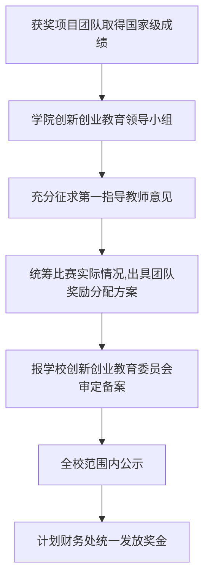
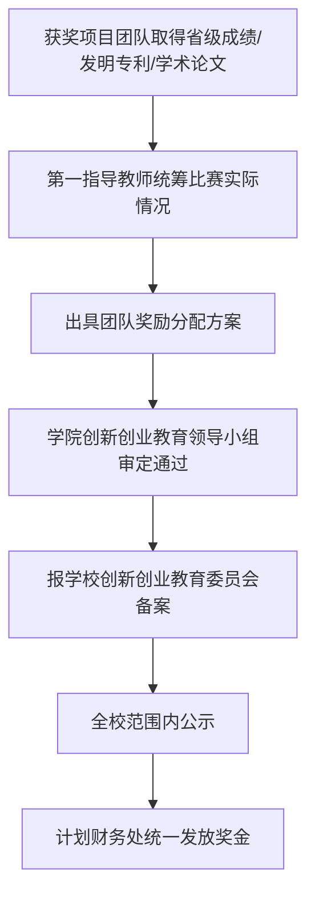
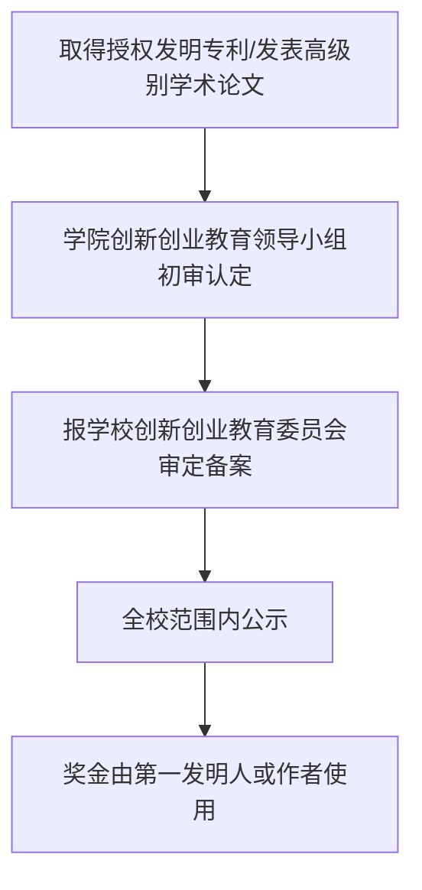

---
tags:
  - 绿皮书
  - 科技创新
---

# 💡 科技创新奖励须知

> 本页面内容依据《济南大学学生科技创新奖励办法》（济大校字〔2024〕122号）整理，如有变动以学校最新文件为准。

---

## 📋 概述

济南大学对学生参加科技创新活动取得的标志性成绩给予奖励，包括**学科竞赛奖项**、**授权发明专利**、**高级别学术论文**及其他突破性成绩。

!!! info "📎 完整原始文件"
    如需查看完整的奖励办法原文，请访问 [济南大学学生科技创新奖励办法](appendix/科技创新奖励办法/济南大学学生科技创新奖励办法.md)

---

## 🎯 奖励范围

### 学科竞赛

学科竞赛能够体现学生创新素质、创新能力，竞赛范围包括：

- 中国高等教育学会发布的**全国普通高校大学生竞赛排行榜**内竞赛
- 中国学位与研究生教育学会发布的**中国研究生创新实践系列大赛**

竞赛类别分为两类：

| 类别 | 包含赛事 |
|------|----------|
| **一类赛事** | 中国国际大学生创新大赛、"挑战杯"全国大学生课外学术科技作品竞赛、"挑战杯"中国大学生创业计划竞赛 |
| **二类赛事** | 除一类赛事外纳入全国普通高校大学生竞赛排行榜内竞赛、中国研究生创新实践系列大赛（以当年公布为准） |

!!! note "竞赛级别说明"
    竞赛如有山东省赛或区域赛，级别按**省级**进行认定，类别不变，以竞赛获奖证书或官方文件为准。

### 授权发明专利

我校全日制在校本科生以**第一发明人**获得授权的发明专利。

### 学术论文

我校全日制在校本科生作为**第一作者**以济南大学为**第一署名单位**发表的高级别学术论文。

| 学科类别 | 认定范围 |
|----------|----------|
| **自然科学类** | SCI、ESI、EI、CPCI-S、CSCD、CSTPCD、中国科技期刊卓越行动计划入选期刊 |
| **社会科学类** | SSCI、A&HCI、CSSCI、中国人文社会科学期刊 AMI 综合评价报告、《中文核心期刊要目总览》 |

### 其他突破性成绩

我校全日制在校本科生、研究生取得的在科技创新活动其他方面的突破性成绩，由学校创新创业教育委员会根据获奖情况研究确定奖励额度。

---

## 💰 奖励方式

### 对学生的激励

学生参与科技创新活动取得的标志性成绩，作为以下事项的**重要参考依据**：

- 推荐优秀应届本科毕业生免试攻读硕士学位研究生（**推免**）
- 学生评奖评优

### 对教师的激励

教师指导学生参与科技创新活动取得的标志性成绩，作为以下事项的**重要参考依据**：

- 年度考核
- 岗位聘用
- 职称评定
- 评奖评优

---

## 🏆 一类赛事国家级成绩奖金标准

对一类赛事获国家级成绩的项目团队按确定奖金标准进行奖励（单位：万元/团队）：

| 赛事名称 | 细分赛道 | 特等奖/金奖 | 一等奖/银奖 | 二等奖/铜奖 | 三等奖 |
|----------|----------|-------------|-------------|-------------|--------|
| 中国国际大学生创新大赛 | — | **20万** | **16万** | **6万** | / |
| "挑战杯"全国大学生课外学术科技作品竞赛 | 主体赛 | **20万** | **16万** | **6万** | **2万** |
| | 揭榜挂帅 | **5万** | **4万** | **1.5万** | **0.5万** |
| | 黑科技 | **2.5万** | **2万** | **0.75万** | **0.25万** |
| | 红色专项 | **2.5万** | **2万** | **0.75万** | **0.25万** |
| "挑战杯"中国大学生创业计划竞赛 | 主体赛 | **16万** | **6万** | **2万** | / |
| | 专项赛 | **2万** | **0.75万** | **0.25万** | / |

!!! info "📎 奖金标准原文"
    如需查看完整的奖金标准文件，请访问 [一类赛事国家级成绩奖金标准](appendix/科技创新奖励办法/附件1%20一类赛事国家级成绩奖金标准.md)

---

## 📊 其他标志性科创成绩积分方法

对一类赛事获省级成绩、二类赛事获省级及以上成绩的项目团队，授权发明专利及发表高级别学术论文的本科生按照**积分制**的方式进行奖金分配（单位：积分）：

| 奖励类别 | 细分层级 | 第一等级（金/一/特等奖） | 第二等级（银/二/一等奖） | 第三等级（铜/三/二等奖） | 若设奖等次最高为特等奖（三等奖） |
|----------|----------|--------------------------|--------------------------|--------------------------|--------------------------------|
| 一类赛事省级奖励 | — | **30** | **20** | **15** | **10** |
| 二类赛事 | 省级奖励 | **15** | **10** | **7** | **5** |
| | 国家级奖励 | **100** | **60** | **40** | **30** |
| 发明专利 | — | **10** | **10** | **10** | **10** |
| 发表论文 | — | **5** | **5** | **5** | **5** |

!!! note "等级说明"
    奖励按照设奖等次名称（如特等奖、一等奖、二等奖或一等奖、二等奖、三等奖或金奖、银奖、铜奖），依次为第一等级、第二等级、第三等级。

!!! info "📎 积分方法原文"
    如需查看完整的积分方法文件，请访问 [其他标志性科创成绩积分方法](appendix/科技创新奖励办法/附件2%20其他标志性科创成绩积分方法.md)

---

## 📝 奖励发放流程

### 一类赛事国家级成绩

### 其他标志性科创成绩（积分制）

### 发明专利与学术论文

---

## ⚠️ 重要说明

| 事项 | 说明 |
|------|------|
| **成绩计算时间** | 当年1月1日至12月31日 |
| **不重复奖励** | 同年同一项目参加不同竞赛或相同竞赛不同级别，按最高获奖等级进行奖励 |
| **无指导教师认定** | 因竞赛主办方等原因获奖证书未注明指导教师的，若实际参赛过程有指导教师，可向学院提出认定申请 |
| **经费来源** | 从学校教育事业经费中支出并纳入学校预算 |
| **违规处理** | 对弄虚作假或以其他不正当手段获取奖励者，学校将撤销奖励、追回奖金，并视情节轻重予以处理 |
