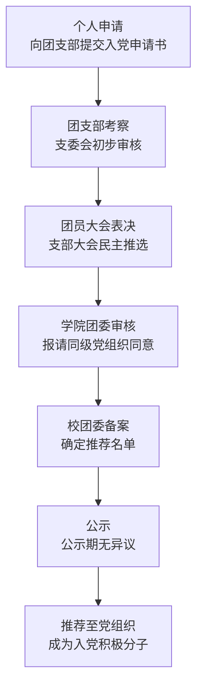
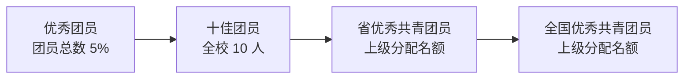

---
tags:
  - 绿皮书
  - 共青团
---

# 🏛️ 推优指南

"推优"是共青团组织的一项核心职能，包含两个层面：

1. **推优入党** — 推荐优秀团员作为党的发展对象
2. **共青团荣誉推荐** — 推荐优秀团员、团干部参评各级荣誉称号

---

## 🚩 推优入党

"推优入党"是指共青团组织向党组织推荐优秀团员作为入党积极分子和发展对象的过程，是团员加入中国共产党的重要途径之一。

### 基本条件

1. **团龄要求**：团龄在一年以上，本人基本信息已登录"智慧团建"系统。
2. **思想要求**：认真学习贯彻习近平新时代中国特色社会主义思想，增强"四个意识"、坚定"四个自信"、做到"两个维护"。
3. **学业要求**：学习目的明确，态度端正，成绩优良。
4. **纪律要求**：遵守国家法律法规，遵守团的章程，履行团员义务，按要求参加"三会两制一课"和团的活动，没有违规违纪行为。
5. **实践要求**：积极参加团的各项活动，在思想引领、科技创新、志愿服务、社会实践、校园文化等活动中表现积极。

### 推优流程

!!! tip "💡 提示"
    推优入党每学期通常组织一次，具体时间以校团委通知为准。建议提前准备好个人事迹材料和思想汇报。

---

## 🏅 共青团荣誉推荐

以下是与共青团相关的各级荣誉称号评选办法，按级别从高到低排列。

### Ⅰ 类 · 国家级

| 荣誉名称 | 评选时间 | 名额 | 详细办法 |
|----------|----------|------|----------|
| 全国优秀共青团员 | 根据上级通知 | 上级分配名额 | [查看办法](../scholarship/appendix/荣誉评选%26奖金/个人荣誉称号/全国优秀共青团员推荐办法.md) |

!!! info "推荐条件"
    - 获得过济南大学"十佳团员"荣誉称号
    - 年度参加志愿服务时长不少于 20 小时
    - 具体条件详见办法原文

### Ⅱ 类 · 省级

| 荣誉名称 | 评选时间 | 名额 | 详细办法 |
|----------|----------|------|----------|
| 山东省优秀共青团员 | 根据上级通知 | 上级分配名额 | [查看办法](../scholarship/appendix/荣誉评选%26奖金/个人荣誉称号/山东省优秀共青团员推荐办法.md) |

!!! info "推荐条件"
    - 获得过济南大学"十佳团员"荣誉称号
    - 年度参加志愿服务时长不少于 20 小时
    - 具体条件详见办法原文

### Ⅲ 类 · 校级

| 荣誉名称 | 评选时间 | 名额 | 详细办法 |
| ---------- | ---------- | ------ | ---------- |
| 济南大学十佳团员 | 每年 4 月 | 10 人 | [查看办法](../scholarship/appendix/荣誉评选%26奖金/个人荣誉称号/济南大学十佳团员评选办法.md) |
| 济南大学优秀团员 | 每年 4 月 | 团员总数的 5% | [查看办法](../scholarship/appendix/荣誉评选%26奖金/个人荣誉称号/济南大学优秀团员评选办法.md) |
| 济南大学优秀团干部 | 每年 4 月 | 团干部总数的 15% | [查看办法](../scholarship/appendix/荣誉评选%26奖金/个人荣誉称号/济南大学优秀团干部评选办法.md) |

---

## 📊 晋升路径总览

!!! warning "注意事项"
    - **优秀团员**：由支部大会民主推选，学院团委审查并报请同级党组织同意后报校团委审批。
    - **优秀团干部**：由支部大会民主推选，学院团委组织**差额评选**，报请同级党组织同意后报校团委审批。
    - **十佳团员**：需先获得校级优秀团干部或优秀团员荣誉称号，由学院团委推荐 1 名候选人至校团委参评。
    - **省级 / 国家级**：需先获得济南大学"十佳团员"荣誉称号，根据上级团组织分配名额推荐。

---

## ❓ 常见问题

**Q：普通团员可以申请哪些荣誉？**
A：可以申请**优秀团员**（支部推选）和**十佳团员**（需先获优秀团员/团干部荣誉）。

**Q：团干部包括哪些？**
A：包括团支部书记、副书记、组织委员、宣传委员。

**Q：推优入党和荣誉评选冲突吗？**
A：不冲突。推优入党是推荐成为入党积极分子，荣誉评选是获得荣誉称号，两者可以同时进行。

**Q：在哪里查看完整的学生荣誉体系？**
A：请访问 [荣誉评选与奖金须知](../scholarship/honor-award.md) 查看完整的荣誉一览表。
