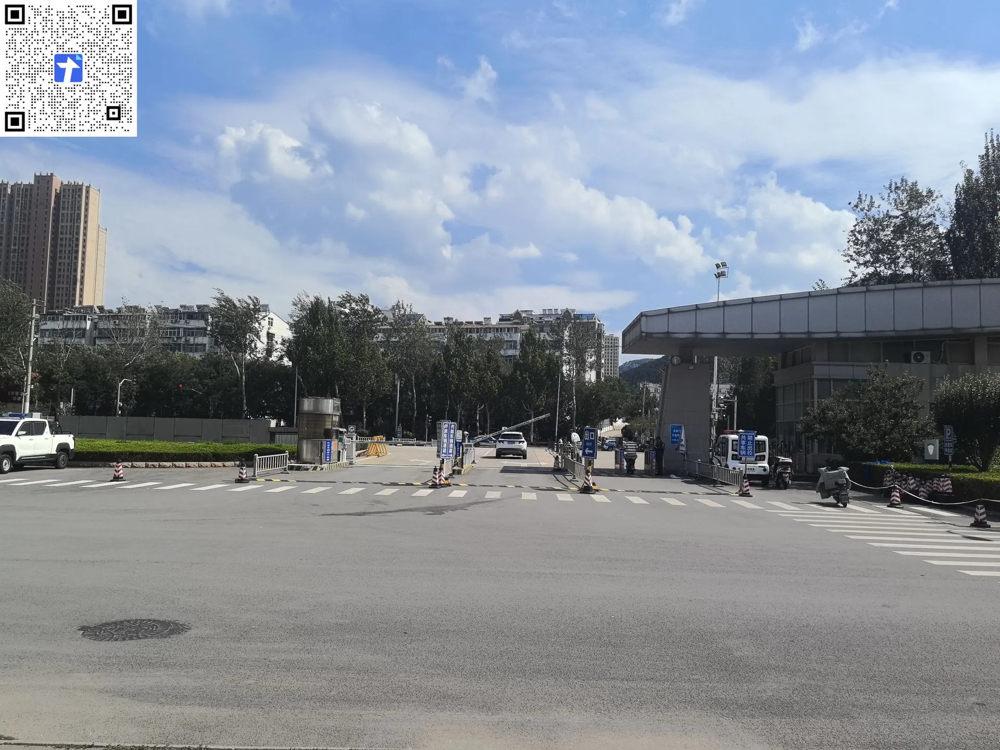
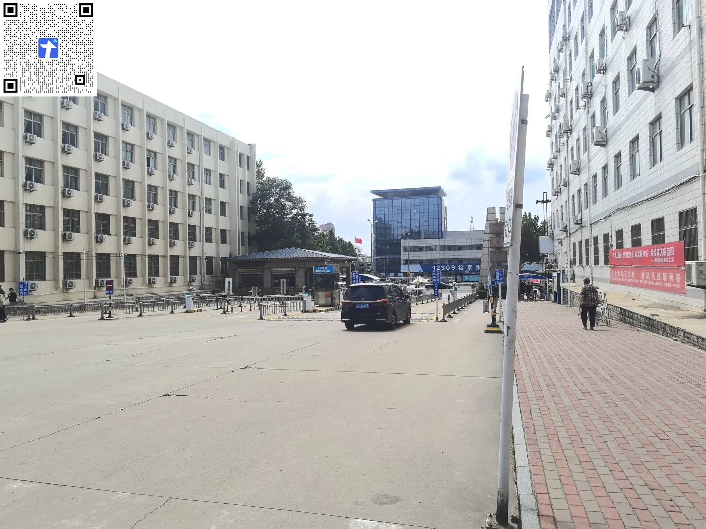
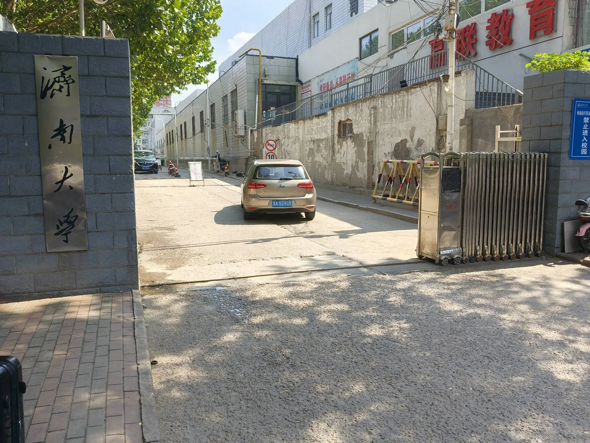
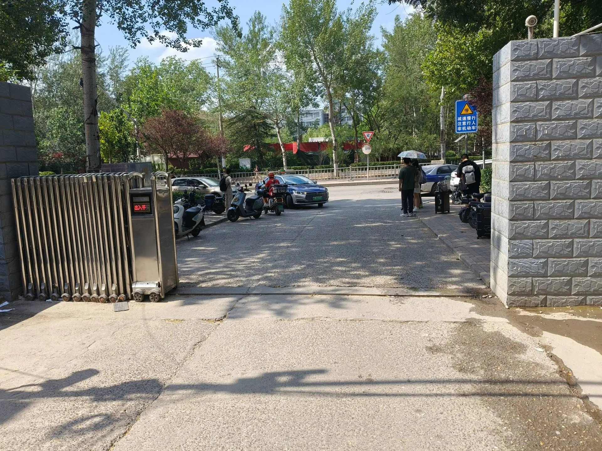

---
tags:
  - 主校区
  - 校门
---

# 🚪 主校区 · 校门

## 北苑东南门

??? info "📍 查看北苑东南门地图"
    

      <iframe src="https://surl.amap.com/mRqoE0dD612" allowfullscreen></iframe>
    

    [🔗 在高德地图中打开](https://surl.amap.com/mRqoE0dD612){ target="_blank" }

## 北苑新西门

??? info "📍 查看北苑新西门地图"
    

      <iframe src="https://surl.amap.com/mQFbAnjd3PR" allowfullscreen></iframe>
    

    [🔗 在高德地图中打开](https://surl.amap.com/mQFbAnjd3PR){ target="_blank" }

## 南苑北门

??? info "📍 查看南苑北门地图"
    

      <iframe src="https://surl.amap.com/mOLUvVjGfIm" allowfullscreen></iframe>
    

    [🔗 在高德地图中打开](https://surl.amap.com/mOLUvVjGfIm){ target="_blank" }

## 北苑老西门

> 只能过人，不能过车。（幼儿园上下学期间不能走人）

??? info "📍 查看南苑北门地图"
    

      <iframe src="https://surl.amap.com/mTMQzg1baHL" allowfullscreen></iframe>
    

    [🔗 在高德地图中打开](https://surl.amap.com/mTMQzg1baHL){ target="_blank" }
