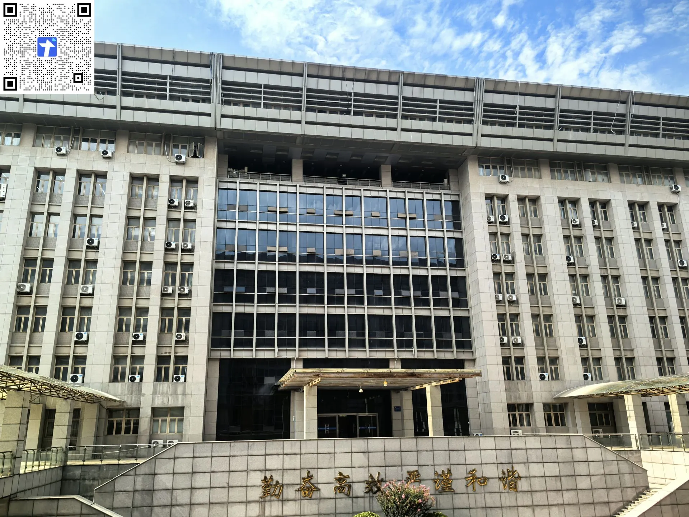

---
tags:
  - 主校区
  - 教学楼
---

:arrow_left: [返回教学楼](./index.md)

---

# 🏛️ 第12教学楼

??? info "📍 查看第12教学楼地图"
    

      <iframe src="https://surl.amap.com/nZyeXlr1eapC" allowfullscreen></iframe>
    

    [🔗 在高德地图中打开](https://surl.amap.com/nZyeXlr1eapC){ target="_blank" }

## 楼层索引

| 楼层 | 单位 / 功能区 |
| :---: | :--- |
| **9F** | 山东省网络环境智能计算技术重点实验室 |
| **8F** | 计算机科学与工程系 网络工程系 计算机公共教学部 |
| **7F** | 行政办公区 学生管理工作办公区 信创空间 |
| **5~6F** | 计算机科学与工程实验教学中心 |
| **4F** | 计算机科学与工程实验教学中心 集成电路实验教学中心 |
| **3F** | 电子与通信工程系 电子与通信综合实验教学中心 |
| **2F** | 国家高分辨率对地观测系统山东数据与应用中心 校园网数据中心 计算机网络实验教学中心 |
| **1F** | 山东省网络环境智能计算技术重点实验室 教育技术与网络信息中心 |
