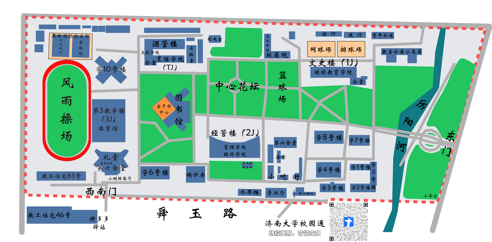

---
tags:
  - 舜耕校区
  - 地点通
---

# 🏫 舜耕校区

济南大学舜耕校区位于济南市**历下区舜耕路 13 号**。

??? info "📍 在高德地图中查看"
    

      <iframe src="https://surl.amap.com/1KrVXW3186Dw" allowfullscreen></iframe>
    

    [🔗 在高德地图中打开](https://surl.amap.com/1KrVXW3186Dw){ target="_blank" }

---

## 📂 分类导览

- :material-school:{ .lg .middle } **教学楼**

    ---

    文史楼、经管楼、酒馆楼

    [:octicons-arrow-right-16: 查看](teaching-buildings.md)

- :material-silverware-fork-knife:{ .lg .middle } **食堂**

    ---

    第六食堂、第七食堂

    [:octicons-arrow-right-16: 查看](canteen.md)

- :material-library:{ .lg .middle } **图书馆**

    ---

    [:octicons-arrow-right-16: 查看](library.md)

- :material-home:{ .lg .middle } **学生公寓**

    ---

    11 栋宿舍楼

    [:octicons-arrow-right-16: 查看](dormitories.md)

- :material-package-variant:{ .lg .middle } **快递站**

    ---

    菜鸟驿站、丰巢、拼多多驿站

    [:octicons-arrow-right-16: 查看](express.md)

- :material-hospital:{ .lg .middle } **校医院**

    ---

    [:octicons-arrow-right-16: 查看](hospital.md)

- :material-soccer:{ .lg .middle } **运动场所**

    ---

    体育馆、篮球场、排球场、风雨操场

    [:octicons-arrow-right-16: 查看](sports.md)

- :material-office-building:{ .lg .middle } **其他设施**

    ---

    基础教育中心、美食街、便利店、营业厅等

    [:octicons-arrow-right-16: 查看](other.md)

