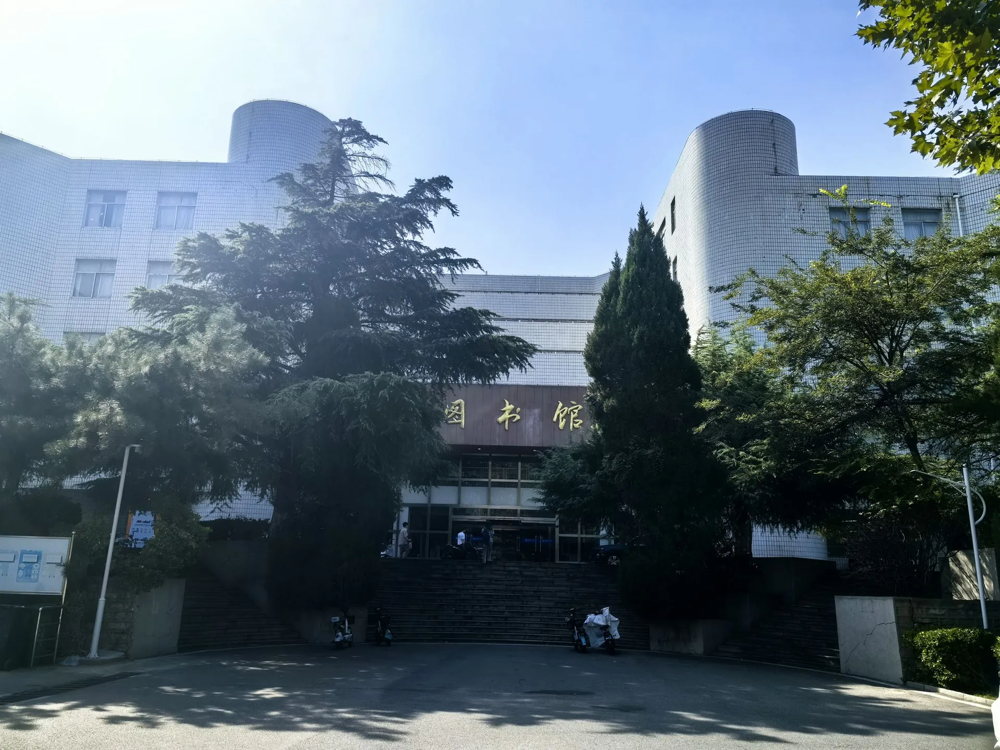

---
tags:
  - 舜耕校区
  - 图书馆
---

# 📚 舜耕校区 · 图书馆

:arrow_left: [返回舜耕校区总览](index.md)

---

??? info "📍 查看图书馆地图"
    

      <iframe src="https://surl.amap.com/vIe43131c3oR" allowfullscreen></iframe>
    

    [🔗 在高德地图中打开](https://surl.amap.com/vIe43131c3oR){ target="_blank" }

---

## 📖 图书馆指南

- :material-book-open-variant:{ .lg .middle } **新生入馆指南**

    ---

    开放时间、入馆凭证、借阅规则、配套服务

    [:octicons-arrow-right-16: 查看](library-guide.md)

- :material-ruler-square:{ .lg .middle } **阅览室规则**

    ---

    座位管理、图书使用、环境秩序、违规处理

    [:octicons-arrow-right-16: 查看](library-rules.md)

- :material-frequently-asked-questions:{ .lg .middle } **常见问题（FAQ）**

    ---

    43 个常见问题及解答

    [:octicons-arrow-right-16: 查看](library-faq.md)

